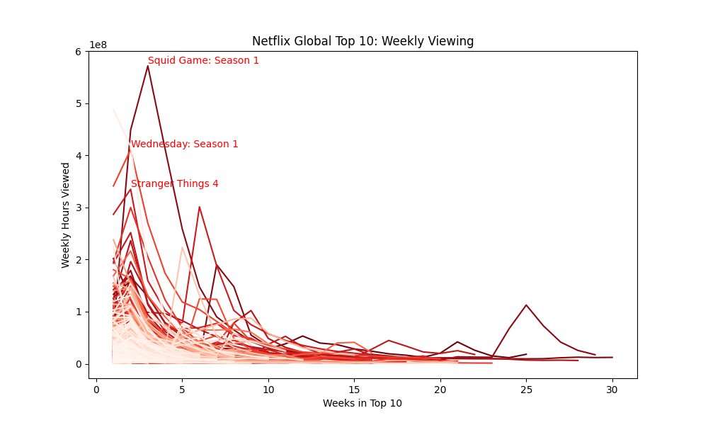
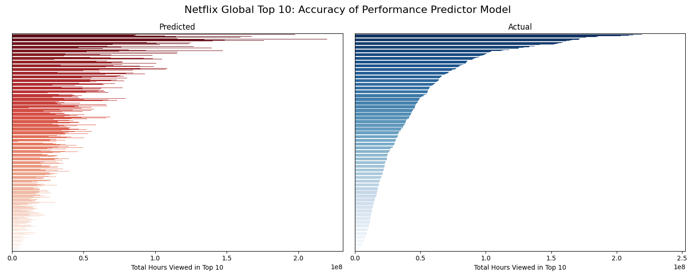

# Netflix Global Top 10 Performance Predictor (Python)

### 🎬 Predicting Netflix Title Performance 📊  

Can you predict how many hours a Netflix title will be viewed based on its first two weeks in the Global Top 10? What trends influence what we watch?  

To find out, I developed a **multiple linear regression model** to forecast the success of Netflix titles in the Global Top 10.    

### 💡Key results:
 - **77.5%** of the variation in total hours viewed is explained by the model
 - **All predictors** were statistically significant, meaning they have a measurable impact on total hours viewed
 - **Category matters:** 📺 **TV shows** tend to perform better than 🍿 **Films** in terms of total viewing hours    

📂 Dataset: [Netflix Global Top 10 dataset](https://www.kaggle.com/datasets/davidpbriggs/most-popular-netflix-shows)  

📊 Project also available on [Kaggle](https://www.kaggle.com/code/davidpbriggs/netflix-global-top-10-performance-predictor)  

    
    

